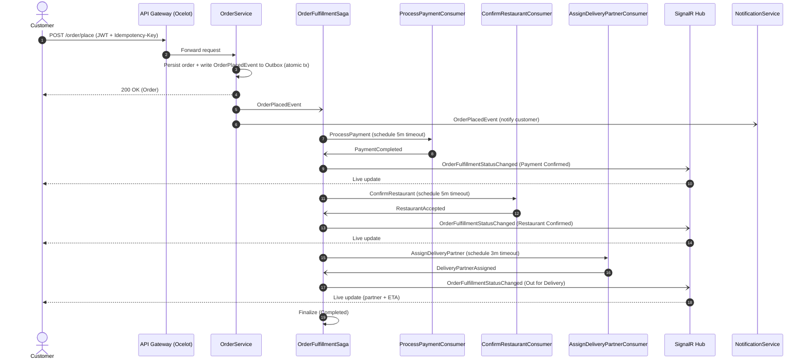

# ?? SwiggyBackend � Food Delivery Microservices Platform

A production-style, event-driven food delivery backend built with **.NET 8**, demonstrating microservices architecture, the **Saga orchestration pattern**, distributed transactions, real-time order tracking, and cloud-native resilience.

> This project was built to explore and demonstrate real-world distributed systems patterns � not just CRUD. It focuses on how independent services coordinate a long-running business workflow (placing and fulfilling an order) reliably, even when individual steps fail.

---

## ?? Table of Contents
- [Architecture Overview](#-architecture-overview)
- [Services](#-services)
- [API Gateway & Routing](#-api-gateway--routing)
- [Key Technical Highlights](#-key-technical-highlights)
- [Order Fulfillment Saga](#-order-fulfillment-saga)
- [Sequence Diagram](#-sequence-diagram)
- [API Reference](#-api-reference)
- [Tech Stack](#-tech-stack)
- [Getting Started](#-getting-started)
- [Configuration](#-configuration)
- [Testing](#-testing)
- [Roadmap](#-roadmap)

---

## ?? Architecture Overview

The system is composed of independently deployable services communicating **asynchronously via a message broker** (RabbitMQ / Azure Service Bus) and **synchronously via HTTP** through an **Ocelot API Gateway**.

---

## ?? Services

| Service | Responsibility | Port |
|---|---|---|
| **ApiGateway** | Single entry point / Ocelot reverse proxy + gateway rate limiting | 8088 |
| **UserService** | User registration, authentication, profile management | 8080 |
| **OrderService** | Order placement, the Order Fulfillment Saga, real-time tracking | 8081 |
| **NotificationService** | Consumes order events and sends notifications | 8082 |
| **RabbitMQ** | Message broker (management UI on 15672) | 5672 |

---

## ?? API Gateway & Routing

The gateway uses **Ocelot**. Routes are loaded from `ocelot.local.json` in Development and `ocelot.json` in Production. A per-IP fixed-window rate limiter (100 req/min) runs **before** Ocelot, so throttled requests never reach downstream services.

| Upstream (client-facing) | Downstream service | Methods |
|---|---|---|
| `/user/{everything}` | `user-api:8080` | GET, POST, PUT, DELETE |
| `/order/{everything}` | `order-api:8081` | GET, POST, PUT, DELETE |
| `/notification/{everything}` | `notification-api:8082` | GET, POST, PUT, DELETE |
| `/user/swagger/{everything}` | `user-api:8080` | GET |

Gateway base URL: `http://localhost:8088`.

---

## ? Key Technical Highlights

- **Saga Orchestration Pattern** � A MassTransit state machine (`OrderFulfillmentSaga`) coordinates a multi-step distributed workflow (Payment ? Restaurant ? Delivery) with **compensating transactions** (refunds) on failure at any stage.
- **Transactional Outbox Pattern** � Uses MassTransit's EF Core outbox so that database changes and published messages commit **atomically**, guaranteeing no lost or phantom events.
- **Timeout & Compensation Handling** � Each saga step has a scheduled timeout (payment 5 min, restaurant 5 min, delivery 3 min). Expired steps trigger automatic cancellation or refund.
- **Real-Time Order Tracking** � **SignalR** hub streams live status updates and delivery location/ETA to clients, with JWT authentication over the WebSocket connection.
- **Resilience Engineering** � Outbound HTTP calls use **Polly** pipelines (retry with exponential backoff + jitter, circuit breaker, per-attempt timeout) via `Microsoft.Extensions.Http.Resilience`.
- **Rate Limiting** � Per-IP fixed window at the gateway (100 req/min) plus a per-user sliding window on order placement (5 orders/min) in OrderService.
- **Idempotency** � `Idempotency-Key` header support so retried requests don't create duplicate orders (24-hour replay window).
- **Distributed Caching** � Redis caching with a `NoOpCacheService` graceful fallback when Redis is unavailable.
- **Observability** � **OpenTelemetry** tracing (ASP.NET Core, EF Core, HttpClient) and **Prometheus** metrics; structured logging with **Serilog**.
- **JWT Authentication & Role-Based Authorization** � Policies for `Customer`, `DeliveryPartner`, and `Admin`.
- **Unit Testing** � xUnit + Moq + FluentAssertions covering controller endpoints (status updates, delivery location/ETA, etc.).

---

## ?? Order Fulfillment Saga

The heart of the system. When a customer places an order (`POST /order/place`), the order is persisted and an `OrderPlacedEvent` is published via the outbox. The `OrderFulfillmentSaga` then drives the order through the following states:

```
Placed
  ?  ProcessPayment (timeout 5m)
  ?
PaymentPending ??PaymentFailed / timeout??? Cancelled
  ?  PaymentCompleted
  ?
RestaurantConfirmationPending ??RestaurantRejected / timeout??? Refunding ??? Cancelled
  ?  RestaurantAccepted (timeout 5m)
  ?
DeliveryAssignmentPending ??DeliveryPartnerNotAvailable / timeout??? Refunding ??? Cancelled
  ?  DeliveryPartnerAssigned (timeout 3m)
  ?
Completed (Out for Delivery)
```

| State | Meaning |
|---|---|
| `PaymentPending` | Awaiting payment confirmation |
| `RestaurantConfirmationPending` | Payment succeeded; awaiting restaurant acceptance |
| `DeliveryAssignmentPending` | Restaurant confirmed; finding a delivery partner |
| `Refunding` | A post-payment step failed; refund in progress |
| `Completed` | Delivery partner assigned; order out for delivery (saga finalized) |
| `Cancelled` | Order cancelled due to failure/timeout (refunded if applicable) |

### Compensation Actions

If any step **after payment** fails (restaurant rejects/times out, or no delivery partner is found):

- The saga sends a `RefundPayment` command and transitions to `Refunding`.
- Once `RefundCompleted` is received, it transitions to `Cancelled`, ensuring no partial orders exist.

### Implementation Notes

- Every transition publishes an `OrderFulfillmentStatusChanged` event that surfaces to the customer in real time via SignalR.
- Saga state is **persisted** (EF Core repository, pessimistic concurrency) so it survives restarts.

---

## ?? Sequence Diagram

Happy-path order fulfillment flow:



> On failure at any post-payment step, the saga sends `RefundPayment`, waits for `RefundCompleted`, and transitions to `Cancelled` (compensation flow).

---

## ?? API Reference

All order endpoints require a JWT (`Authorization: Bearer <token>`). Auth endpoints are on OrderService; user management is on UserService.

### Auth (OrderService)
| Method | Route | Description |
|---|---|---|
| POST | `/api/auth/login` | Authenticate and receive a JWT |
| POST | `/api/auth/register` | Register a new user (proxies to UserService) |

### Orders (OrderService) � `[Authorize]`
| Method | Route | Policy / Role |
|---|---|---|
| POST | `/order/place` | `CustomerOnly` (requires `Idempotency-Key`, rate-limited) |
| GET | `/order/track/{id}` | `CustomerOrAdmin` |
| POST | `/order/update-status` | `Admin`, `DeliveryPartner` |
| POST | `/order/update-location` | `DeliveryPartnerOnly` |
| GET | `/order/timeline/{orderId}` | `CustomerOrAdmin` |
| GET | `/order/recommendations/{userId}` | `CustomerOrAdmin` |
| GET | `/order/saga-status/{orderId}` | `CustomerOrAdmin` |

### Users (UserService)
| Method | Route | Description |
|---|---|---|
| POST | `/user/register` | Create a user |
| POST | `/user/validate` | Validate credentials (used by AuthController) |
| GET | `/user/{id}` | Get user by ID |
| PUT | `/user/{id}` | Update user profile |
| DELETE | `/user/{id}` | Deactivate user |
| GET | `/user/by-role/{role}` | List users by role |

### Real-time
| Transport | Path | Description |
|---|---|---|
| SignalR | `/order-tracking-hub` | Live order status & delivery location (JWT via `access_token` query) |

---

## ?? Tech Stack

- **Runtime:** .NET 8 / C# 12
- **API Gateway:** Ocelot
- **Messaging:** MassTransit + RabbitMQ (or Azure Service Bus)
- **Data:** SQL Server (EF Core), Redis
- **Real-time:** SignalR
- **Resilience:** Polly / `Microsoft.Extensions.Http.Resilience`
- **Observability:** OpenTelemetry, Prometheus, Serilog
- **Auth:** JWT Bearer
- **Testing:** xUnit, Moq, FluentAssertions
- **API Docs:** Swagger / OpenAPI
- **Containerization:** Docker / Docker Compose

---

## ?? Getting Started

### Prerequisites
- .NET 8 SDK
- Docker Desktop
- SQL Server & Redis instances (Redis defaults to `localhost:6379`)

### Run everything with Docker Compose

The repository's `docker-compose.yml` builds all services plus RabbitMQ (service ports match the container ports � e.g. OrderService listens on `8081`):

````````yaml
version: '3.8'
services:
  rabbitmq:
    image: masstransit/rabbitmq
    container_name: rabbitmq
    ports:
      - "5672:5672"
      - "15672:15672"
    environment:
      RABBITMQ_DEFAULT_USER: guest
      RABBITMQ_DEFAULT_PASS: guest
    volumes:
      - rabbitmq_data:/var/lib/rabbitmq

  order-api:
    build:
      context: ./OrderService
      dockerfile: Dockerfile
    ports:
      - "8081:8081"
    environment:
      - MessageBroker__Provider=RabbitMQ
      - RabbitMQ__Host=rabbitmq
    depends_on:
      - rabbitmq

  user-api:
    build:
      context: ./UserService
      dockerfile: Dockerfile
    ports:
      - "8080:8080"

  notification-api:
    build:
      context: ./NotificationService
      dockerfile: Dockerfile
    ports:
      - "8082:8082"
    environment:
      - MessageBroker__Provider=RabbitMQ
      - RabbitMQ__Host=rabbitmq
    depends_on:
      - rabbitmq

  apigateway:
    build:
      context: .
      dockerfile: ApiGateway/Dockerfile
    ports:
      - "8088:8088"
    environment:
      - ASPNETCORE_URLS=http://+:8088

volumes:
  rabbitmq_data:
````````

Once running:
- API Gateway: `http://localhost:8088`
- RabbitMQ management UI: `http://localhost:15672` (user: `guest`, pass: `guest`)


## ? Configuration

Configuration is read from environment variables first, then `appsettings.json`. Key settings:

| Setting | Purpose | Example |
|---|---|---|
| `ConnectionStrings__DefaultConnection` | SQL Server connection | `Server=localhost;Database=SwiggyDb;User Id=sa;Password=...;TrustServerCertificate=True` |
| `ConnectionStrings__Redis` | Redis connection | `localhost:6379` |
| `JwtSettings__SecretKey` | JWT signing key (**never commit real secrets**) | `<32+ char secret>` |
| `JwtSettings__Issuer` / `JwtSettings__Audience` | JWT validation | `OrderService` / `FoodDeliveryApp` |
| `MessageBroker__Provider` | `RabbitMQ` or `AzureServiceBus` | `RabbitMQ` |
| `RabbitMQ__Host` / `RabbitMQ__Username` / `RabbitMQ__Password` | Broker connection | `rabbitmq` (Docker) / `localhost`, `guest`, `guest` |
| `UserService__BaseUrl` | OrderService ? UserService calls | `http://localhost:8080` |
| `SKIP_DB_MIGRATION` | Skip startup migrations when `true` | `false` |

> ?? **Security note:** Secrets (JWT key, connection strings) must be supplied via environment variables, User Secrets, or a vault � not committed to source control. The sample key in `appsettings.json` should be treated as compromised and rotated.

---

## ?? Testing

```bash
dotnet test
```

The `OrderService.Tests` project (xUnit + Moq + FluentAssertions) covers controller endpoints including order status updates, delivery location/ETA calculation, history logging, cache updates, and SignalR broadcasts.

---


## ?? Author

**Akshay Negi** � [github.com/akshaynegi18](https://github.com/akshaynegi18)
